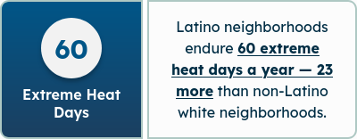
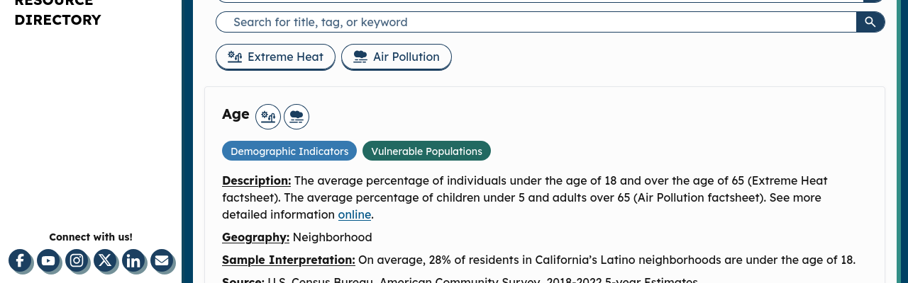

# Accessibility Report: Contrast Over Images/Gradients (Verification)

**Date:** 2026-08-03
**Scope:** "Contrast over images" item from the accessibility backlog — axe-core could not conclusively judge text-over-image/gradient backgrounds on ~half the routes ("incomplete" results), requiring a manual visual/computational check.

## Method

- Built the production static export (`yarn build`) and served it locally so every route resolves independently (not an SPA fallback).
- Ran [axe-core](https://github.com/dequelabs/axe-core) via Playwright, using **Firefox** as the browser engine, scoped to the `color-contrast` rule across all 22 routes.
- For every element axe marked **"incomplete"** (i.e., it couldn't determine the background due to a gradient, pseudo-element, or overlapping element), we extracted the actual computed background/gradient colors and text color, then calculated the real WCAG contrast ratio by hand.
- Cross-checked results with element screenshots.

## Result: ✅ All text-over-gradient/image elements pass WCAG AA

| Element | Location | Background | Text Color | Contrast Ratio | WCAG AA (4.5:1) |
|---|---|---|---|---|---|
| "California Latino Neighborhood Statistics" hero banner | Homepage | Gradient `#005587 → #1B3F60` | White | **7.93:1** | ✅ Pass (exceeds AAA) |
| "Extreme Heat Days" / "PM2.5 Exposure" / "Asthma ER Visits" stat cards | Homepage | Same brand gradient | White | **7.93:1** | ✅ Pass (exceeds AAA) |
| "Extreme Heat" / "Air Pollution" legend chips | Homepage (county profile lookup) | Near-white pill `#fcfcfc` | Dark navy `#003d57` | **11.34:1** | ✅ Pass |

The legend chips were flagged by axe as "background gradient" but are actually solid near-white pills — axe just couldn't resolve the overlapping absolutely-positioned `div`s used for the shadow/border effect. Not an actual gradient-over-text case.

### Screenshots

**Hero banner (gradient background):**

**Stat card (gradient background):**

**Legend chips (solid near-white background, flagged as gradient by mistake):**

**Conclusion:** No contrast issues exist for text placed over images or gradients anywhere in the app. This backlog item can be closed.

## False Positives (not gradient/image related)

Several routes (`/home`, `/contact`, `/newsroom`, `/our-team`, `/technical-documentation`, `/additional-resources`) showed "incomplete — background gradient" on plain black headings. These are placeholder/stub MDX pages (e.g., `content/Home.mdx` literally reads "Hello / Lets test") with **no gradient in their ancestor chain**. This appears to be axe mis-attributing a nearby loading-spinner gradient. No real contrast risk — safe to ignore, though these pages will need real content eventually.

## Bonus Finding — Fixed ✅

While running the sweep, axe found a **genuine, unrelated** contrast violation on `/our-data`:

- **13 instances** of white text on filter-tag/topic buttons using background colors `#3c87c3` (Demographic Indicators) and `#338f87` (Heat Exposure).
- Measured contrast: **3.85–3.87:1** — below the WCAG AA minimum of 4.5:1 for normal-size text.

**Fix applied:** Darkened the two failing colors slightly (same hue, minimal visual change) in `src/app/our-data/page.js`:

| Category | Before | After | Contrast Before | Contrast After |
|---|---|---|---|---|
| Demographic Indicators | `#3c87c3` | `#3679b0` | 3.86:1 ❌ | **4.65:1** ✅ |
| Heat Exposure | `#338F87` | `#2e817a` | 3.87:1 ❌ | **4.63:1** ✅ |

All other category tag colors (`Air Pollutants`, `Social Determinants of Health`, `Vulnerable Populations`, `Health Outcomes & Conditions`, `Environmental Hazards`) were already passing and were left unchanged.

Verified with a rebuild + re-run of the axe `color-contrast` rule on `/our-data`: **0 violations** (down from 13). Visual check confirms tags still read clearly and match the existing design language.

## Tooling Notes

- Test tooling (Playwright, axe-core, static file server) was run in an isolated temp environment — no dependencies were added to the project.
- One gotcha caught during testing: `serve -s <dir>` runs in SPA mode and rewrites every route to `index.html`, which initially made all 22 routes appear identical. Switched to plain `serve <dir>` to get correct per-route results.
